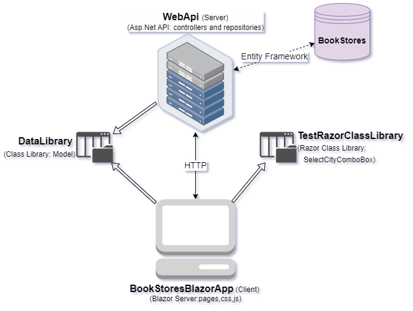
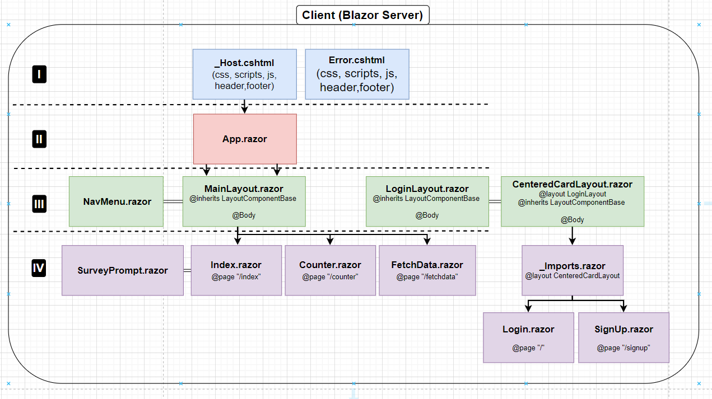

Blazor Server Web App

**Key technologies:** *Blazor Server, Razor page, ASP.NET Core Web API, NET 7, C#, Microsoft SQL Server, Entity Framework, CRUD, HttpClient, Class Library, 
Custom Authentification and Authorization (without Microsoft.AspNetCore.Identity), Blazored.LocalStorage.ILocalStorageService, Access Token, DTO(Data Transfer Objects)*

## Information
This website based on the Blazor framework. The server is ASP.NET Core Web API and client is Blazor Server. CRUD operations in API were implemented. Server(API) and client (Blazor Server) connection using HttpClient. 
The custom authentification and authorization were realized.
The attention was focused on the backend side of the application.

## The structure
### The structure of the general app

### The hierarchy of htmls in Blazor Server

## The custom authorization
picture

### Users
Test

### DataBase
picture

### Blazored.LocalStorage
Test and picture

